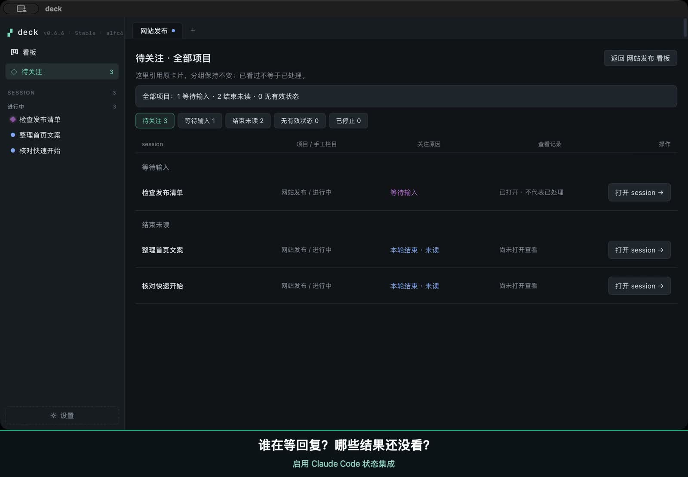

# deck

**A native macOS app for managing multiple terminal agent sessions.** Run
Claude Code, Codex, or other CLIs in persistent terminals, organize them on a
board, and find the sessions that need your attention.

[Website](https://deck.c9r.io/) · [Watch the 26-second demo](https://deck.c9r.io/#demo) · [Download Stable](https://github.com/c9r-io/deck/releases/latest) · [User guide](https://deck.c9r.io/guide/) · [简体中文](docs/zh-Hans.md)

- **Keep tasks organized.** Each card is a real tmux session. Group cards by
  project and open several terminals in split view; you control their placement.
- **Find where to look next.** Enable Claude Code or Codex status integration
  to see input requests and unread turn endings across projects. Without it,
  deck shows output activity; silence alone does not mean a task is finished.
- **Leave the app, keep sessions running.** Sessions survive quitting deck.
  Restarting your Mac or its background shell service ends running processes.

deck runs locally and includes tmux. Install and sign in to your preferred
agent CLI separately; its model service and charges belong to that tool.
No deck account is required. MIT licensed.

[](https://deck.c9r.io/#demo)

*26 seconds recorded in Deck 0.6.6: find a waiting Claude session, open its
terminal, approve a request, and read the result. Chinese interface and
captions, no audio; waiting time is cut.*

## Install

Requires **macOS 11 or later on Apple Silicon**. Intel Macs are not currently
supported. Voice recording requires a supported macOS 12+ on-device speech
configuration; see [voice input](docs/voice-input.md).

1. Open the [latest Stable release](https://github.com/c9r-io/deck/releases/latest)
   and download its `deck_<version>_aarch64.dmg` asset.
2. Open the DMG, drag **deck** to **Applications**, then open deck. The app is
   signed and Apple-notarized, and tmux is included.
3. Select a project and click **＋ New session**. Use `cd` to enter your working
   directory, then run an installed CLI such as `claude` or `codex`, or any
   ordinary shell command.
4. Return to the Board while it runs; click the card to reopen its terminal.
   To see agent input requests and turn endings, enable the matching Agent
   status option in **Settings → Integrations & automation**.

[First-task walkthrough](https://deck.c9r.io/guide/start/) · [Status integration and signals](https://deck.c9r.io/guide/attention/)

Updates appear as a button in the sidebar. Stable is the default channel.

### Update channels

Stable is the default and reads only the latest non-prerelease Release.
Maintainers and testers can explicitly opt into **Nightly** in Settings to
exercise a signed and notarized candidate through its separate feed. Nightly
uses the same app identity and `~/.deck` data, so it replaces Stable rather
than installing beside it. Back up important data first and do not run Stable
and Nightly at the same time. Switching back to Stable affects future checks
but does not downgrade a newer Nightly; reinstall the Stable DMG if a downgrade
is required. See [release channels](docs/release-channels.md) for the complete
operator and recovery guide.

## What it does

The website guide covers Stable 0.6.6 using the 0.6.5 feature baseline. The
technical reference below follows the current source and remains canonical.

**Boards are manual groups, independent of live status.** Default groups per
project remain *Attention* · *Working* · *Queued* · *Parked*. Their names,
card positions and order are yours; status never moves a card. Cards show their
live status. Status summaries and filters live in the sidebar’s Needs attention
view, keeping the Board focused on its groups.

**Needs attention spans all projects.** Its sidebar entry links to sessions
with an explicit input request or an unread turn ending, showing each card's
original project and group. Opening a session successfully marks its ending as
viewed, not handled or task-complete; an input request stays until its state
changes. The back action restores the attention filter and position. Quiet or
recent output without valid agent state is separate from confirmed requests:
quiet never means ready. Failed or incomplete polls keep a labelled old
snapshot, and stale/stopped entries only locate their original cards. Read
markers last for this app run; hook reporting and unread history are not
promised to survive restarts.

**Sessions outlive the app.** deck runs its own private tmux server, so
quitting deck (or it crashing) never kills your agents. Reopen and everything
is exactly where you left it. Closing a card (corner ✕, or Ctrl+D in the
shell) is the only way a session ends.

**Upgrades have an explicit process boundary.** Reopening the same deck build
keeps the same tmux server PID and every running process. After deck itself is
upgraded, an empty old server is replaced automatically; if it still owns
sessions, deck asks before restarting the background shell service and shows
what will be affected. You can choose Later and keep using existing sessions,
but finishing the restart ends their commands and agents—Unix processes cannot
be migrated into a new tmux server. The pending action remains in the sidebar
and Settings. Reopening a card afterwards starts its shell in the card's
directory (with the recovered text below, when shell recovery is on) and does
not run the launch command again: a command belongs to the card's creation and
is sent once, so whatever you left at the prompt — an agent's resume hint, for
instance — is where you look first, and restarting the program is your call.
The one exception is a card whose first start never delivered its command.

**A real terminal.** Full xterm with truecolor, ⌘C/⌘V, clickable existing
local file paths, and complete HTTP(S) URLs even across terminal soft wraps.
Drag directly over terminal cells; holding at either vertical
edge continuously extends the same selection through tmux history, including
reverse shrinking across screens. A path can open in the editor, reveal in
Finder, open its parent in the configured editor, or start a new session in
that parent directory.

**Split view.** Watch several agents at once: drag a card from the sidebar
onto a pane edge, or hit ⌘D / ⌘⇧D (or the ◧ ⬓ buttons) and pick a session.
Splits nest freely, dividers drag to resize, closing a pane never kills the
session.

**Voice drafts.** The session header's microphone records into an editable,
on-device transcript. Clear, Insert only and Send can stop recording and act
on the displayed text directly; an empty draft does nothing. Each session retains its own draft, recognition language and target
binding when you switch sessions. The same editor switches between Bottom (default), Floating and Right
without restarting capture; the choice lasts for this app run. Native local
recognition requires a supported macOS 12+ configuration; macOS 26 builds use
the newer Speech engine where available. There is no cloud speech fallback.
The language menu defaults to Chinese, English and Japanese. Settings → Terminal
& sessions → Voice input saves your enabled languages and default; choosing
only one language hides the draft's selector.
See [voice input](docs/voice-input.md) for target checks, permissions and limits.

**Complete, safe themes.** Settings offers Deck Dark (the compatible default),
Light, Follow System, and High Contrast, plus reviewed teal, blue, purple, and
orange accents. A switch updates the whole app, every open xterm pane, ANSI
palette, cursor, selection, focus and tmux copy-mode highlight immediately;
new splits inherit it. Follow System reacts live to macOS appearance changes.
Only the closed presets can be selected—there is no free-form color input—and
the previous palette is restored if settings cannot be saved.

**Group-ordered sidebar.** Sessions in the current project are grouped under
their group names, in group order, with counts in each group. Sessions retain
their durable card order within a group even as live/quiet/stopped status
changes, so navigation never moves merely because a session was opened.

**One persistent action.** The Board head keeps **＋ New session** and its
▾ menu; everything else about starting a session lives in that menu — new
session now, new on a clock, new on a Slack badge, and the two managers
(Automations…, Templates…, Project defaults…). A **↻ N automation(s)** chip
appears beside it only while the project has rules. A project with no
sessions shows one starting point above its groups instead of four empty
columns.

**Project defaults.** A project may carry a default directory and a default
launch command (right-click the project tab, or New session ▾ → Project
defaults…; both optional). With them, ＋ / ⌘N start the session in that
directory and send that command once — one click to working — and the menu's
first item says exactly what it will do; **New shell only** keeps the
directory without the command. Without them, ＋ opens a shell in `$HOME` as
before. Context entries — a card's *New session in this directory*, the path
menu's *parent folder*, a split's *new shell here* — keep their own directory
and are always shells. Every creation starts the tmux session first and writes
the card only after that succeeded, so a directory that no longer exists asks
(cancel / edit the defaults / a shell in `$HOME`) and never leaves a card behind.

**Command completion, Warp-style.** deck records the commands you run in its
shells (agent prompts are never recorded) and suggests as you type: the first
match appears as gray ghost text at the cursor — **Tab or →** applies it; more
candidates sit in a reserved row below. Only the focused pane gives up that
row, and xterm plus the underlying PTY are refit together.

**Bounded shell recovery.** This opt-in feature is off by default. While a pane
is back at a shell prompt, deck checkpoints its current directory and up to
256 KB of recent plain output after redacting common credential shapes.
After a machine/tmux restart, opening the card starts a new shell in that
directory and places the old text directly in that pane's tmux scrollback,
above a clear restart boundary and the new live prompt. The text is written
only to pane output, never shell input, so commands are not replayed; processes,
jobs, environment variables and agent TUIs are not restored. Snapshots are
private 0600 files, have no backup copy, expire after seven days, and are
cleared when recovery is disabled. Redaction is best-effort, so the consent
prompt still warns that terminal output may contain secrets.

**Lists.** A card's ⏱ panel holds its lists: prompts to type into that
session later, sent in order. The first row is time-based; later rows wait
for the configured quiet interval ("once quiet for 3 min" — an activity
observation, not evidence that the program is ready or the work succeeded). A list has two optional fields: **not
before** a date and time ("Friday 14:00, when my Claude window resets"; a
past instant is refused, never rolled to tomorrow) and **repeat** — every
5 min to 4 h, optionally only inside a daily window ("only 09:00–18:00";
20:00–08:00 wraps midnight), until you remove it, N times or a set time. A
repeating list sends all its rows again at every interval into the same
session (⏸ keeps its settings). Lists on one card may interleave; their order does not establish a work
dependency. Repeat counters count deliveries, not successful tasks. Before delivery deck resolves the pane the card owns and pins the
exact tmux server/session/window/pane/process generation it just read — a
pane that came back with a new generation (after an update, a crash or a
reboot) is adopted automatically, so a list never needs re-pointing. When
the card launch command identifies a program, deck also waits for that
executable to return to the foreground; otherwise it sends to the same
pane in compatibility mode, where input may be interpreted by a shell.
Context waiting does not consume a delivery attempt. Works while detached;
dead sessions are started and probed with a bounded wait; lists survive
restarts. The app must be running for rows to fire.

**Inspect each step.** Lists and automation rules can explicitly enable
inspection after every delivered row, including the last. Existing lists
remain unchanged. The sent row stays as a durable checkpoint until you view
the result and choose **Inspected, allow next…**. Opening the pane, quiet,
permission waits and hook reports never count as inspection. The dialog names
the next prompt; confirmation permits only that revision and target. Editing,
retrying or changing the target revokes unused permission. The next row still
obeys its schedule, minimum gap and context checks. A cancelled or skipped row
is omitted work, not inspected work. Other lists can continue in the session.
Repeating lists require fresh inspection in each iteration. A last-row
confirmation releases that iteration's final hold; it does not terminate a
process itself. An opted-in automation cannot use its automatic finish path
before that final inspection. Rule changes affect new runs only.

The panel separates the execution plan from independent agent observations,
and keeps up to 200 delivery and 200 inspection records without historical
prompt text. Sent text remains in its pending checkpoint until that checkpoint
is consumed. See [the checkpoint contract and data compatibility](docs/scheduler-context-safety.md#human-inspection-checkpoints-c-v01).

**Delivery you can reason about.** One prompt per session at a time, at least
a minute apart; different sessions run independently (a session that needs a
startup wait never delays another session's prompt). Immediately before
delivery, deck rechecks the automatically captured target identity and optional
foreground executable. Prompt + Enter are literal-pasted only if both still
match. If deck crashes in the narrow delivery window,
the list shows the row as **ambiguous** instead of claiming success or
silently sending it again: acknowledge it as sent, or explicitly retry while
accepting the possible duplicate. While a row is mid-send (a window of
seconds), editing/pausing/removing it is refused with a clear message
instead of racing the delivery. If a row permanently fails to
send (its session can't start, say), the later rows of its list **wait** —
the list shows ⚠ with retry ↻ and skip ⏭ buttons, and nothing runs past a
failed row until you decide.

**Automations.** A standing job is not a card's list: it is a project-level
rule (New session ▾ → Automations… on the Board, or the ↻ chip once the
project has one) with a **trigger** — a clock (every day,
chosen weekdays or days of the month, at a local time) or a **Slack badge**
(an emoji reaction you put on a message; see
[docs/auto-respond.md](docs/auto-respond.md) for the one-time Slack
connection in Settings). When it fires, deck creates a fresh card in a
column, launches the command and queues a template in a new session. A launch
command may restore its own prior context; a clock runs one card at a time.
With "close the card", the existing finish check requires an empty queue and
a reported turn end (or, without a hook state, a shell in the foreground) for
three consecutive polls, and no open pane showing the card. These observations
do not prove business success or correlate a report to the final delivery.
Opted-in runs additionally require final human inspection. A clock slot that comes due while deck is not running still
starts within 15 minutes (or, if you choose, the same day) and is otherwise
recorded as missed; a rule you resume or reschedule starts from that
moment. The drawer shows each rule's next slot and its last runs.

**Templates.** A template is a saved list, per project (Templates… from
New session ▾, from a list's 📋 menu or from the automation editor; ☆ in a
list's 📋 menu saves that list as one). 📋 on a card starts a new list from
one or inserts one into a list — a copy, so a template changed later leaves
the rows alone; an automation names one and sends it on every run.

**Honest signals.** Green = output in the last 15 s. Amber = quiet, may be
waiting for you. Memory chips show the *whole process tree* of a session
(shell + agent + everything it spawned), not just the shell.

## Day-to-day

| Action | How |
| --- | --- |
| New session | ＋ New session → you're in a shell (`$HOME`, or the project's default directory running its default command); recent commands offered as chips |
| Project defaults (directory · command) | right-click the project tab · New session ▾ → Project defaults… · the empty project's link |
| Target group for new sessions | click a group's empty area (accent edge marks it) |
| Enter / leave a session | click card · back button (shows the group name) or Esc |
| Move cards | drag & drop between groups |
| Automations · templates | New session ▾ (or right-click the project tab); ↻ chip once a rule exists |
| Close | card ✕ / Ctrl+D in shell (instant) · in-session Close (confirms) |
| Copy terminal text | drag directly in the terminal (hold at an edge to cross screens) · ⌘C |
| Rename / describe | double-click titles · right-click card |
| Split view | drag a card onto a pane edge · ⌘D right / ⌘⇧D down |
| Lists of prompts to send later | ⏱ in the session header; 📋 for templates |
| Collapse sidebar | ⌘B |

## Data

Settings is organized into six searchable categories, with navigation and the
Done button kept visible while the content scrolls. **Data & logs** shows the
current diagnostic log size and offers **Export logs…** and **Reset logs…**.
Reset requires confirmation and clears only `app.log`, without a backup; new
events continue to be recorded. Exported logs, command history, shell recovery
data and running sessions are preserved. History and recovery data have their
own separate clear actions.

Everything lives in `~/.deck/` as plain JSON you can inspect or edit:
`deck.json` (boards, cards, and each live pane's latest directory) · `queue.json` (lists, incl. card/tmux
identity, an optional sanitized executable basename, a content-free last
context result, and a short
delivery audit) · `history.json` (command history; wipeable from
Settings) · `shell-state/*.json` (opt-in, redacted, seven-day shell transcript
snapshots; wipeable or disableable from Settings) · `settings.json` (including locale, theme,
accent, shell recovery and update channel) · `app.log` (diagnostics — event codes and
counts only, never what you type; errors appear as categories, never as
raw paths, and session names as a per-run tag rather than the name itself).
Every line is redacted again as it is written—including assignment/JSON/
quoted/ANSI-wrapped paths, URLs and credential shapes—and logs or exports an
older deck left behind are cleaned up in place at first launch.

The whole directory is readable only by you: `~/.deck` is 0700 and every
file — including backups, quarantined corrupt files, logs and exports — is
created 0600 from its first byte; deck re-restricts anything an older
version left more open at every launch.

Every file keeps a `.bak` of its previous good version. If a file is
damaged, deck sets the damaged bytes aside as `<file>.corrupt-<timestamp>`,
restores from the backup, and tells you — it never silently replaces your
data with an empty default. A file written by a NEWER deck (or one whose
version header deck cannot read) is left byte-for-byte alone instead of
being overwritten.

Terminal drag selection has one explicit owner. tmux copy-mode tracks the
anchor and active endpoint while the pointer is down; at pointerup deck freezes
the exact tmux bytes and content coordinates under a generation token. A small
public-geometry overlay then follows those content rows while tmux scrolls the
viewport, so scrolling cannot move the completed range. Holding a drag at the
pane's top or bottom edge continuously crosses screens without leaving the
terminal. ⌘C waits for the freeze and copies only that immutable logical text
through the native macOS clipboard; with no selection it leaves the clipboard
untouched.
Hard newlines and real blank lines are retained, soft wraps are rejoined, and
ANSI drawing sequences are excluded. Each pane keeps a 50,000-row tmux history;
deck reports when that reachable history limit is hit and refuses a clipboard
payload above 64 MiB instead of silently truncating the highlighted selection.

Closing a card — or deleting a project, or letting its shell exit —
permanently cancels every scheduled prompt for that session, and the card
only leaves the board once that cancellation is on disk, its tmux session is
stopped, and the resulting Board is durably saved. A kill or save failure keeps
the cards visible, manageable, and retryable. Nothing deck schedules can
outlive the card it belongs to.

All Board changes share one serial persist-before-commit transaction stream.
A later close, rename, move, project edit, or debounced description is computed
from the latest committed state when its turn begins, so concurrent UI actions
cannot resurrect a card or silently overwrite each other.

Production sessions live on a dedicated tmux socket: `tmux -L deck ls` shows them,
`tmux -L deck attach -t <name>` attaches from any terminal — deck never
touches your personal tmux server. Source builds use `deck-dev`; packaged smoke
tests require a `deck-smoke*` socket, so they cannot attach to production by
accident.

## Building from source

```bash
app/run.sh                                # build + launch the dev bundle
app/run.sh --debug-logging                # add structured verbose diagnostics
cd app/src-tauri && cargo run --example pty_smoke   # headless PTY test
app/src-tauri/binaries/build-tmux.sh      # rebuild the static tmux sidecar
```

Verbose frontend diagnostics are maintainer-only and remain structured and
redacted. For an installed build, quit deck first and launch it with
`open -n /Applications/deck.app --args --debug-logging`; omitting the flag
keeps verbose events off.

Requires a Rust toolchain. The frontend (`app/ui/`) is plain HTML + native
ES modules — no Node runtime, no bundler (Node is used only for dev-time
checks: `node --check`, `node --test app/ui/test/*.test.mjs`,
`node app/ui/js/check.mjs`).

Releases use strict numeric versions. `scripts/release-version set X.Y.Z`
prepares a version commit. The manual `nightly` workflow builds and verifies an
immutable prerelease; the `promote` workflow copies that exact tested DMG and
updater archive into Stable without rebuilding. Directly pushing a strict
`vX.Y.Z` tag remains the emergency source-build path. The hourly resolver only
considers Stable tags and never deletes an incomplete Release. Full procedures
are in [docs/release-channels.md](docs/release-channels.md).

## Feedback

Use the [feedback issue form](https://github.com/c9r-io/deck/issues/new?template=feedback.yml)
to tell us what became easier or what got in your way. GitHub issues are public:
do not include prompts, commands, terminal output, secrets, private paths,
session names, project names, or repository names.

## License

MIT
