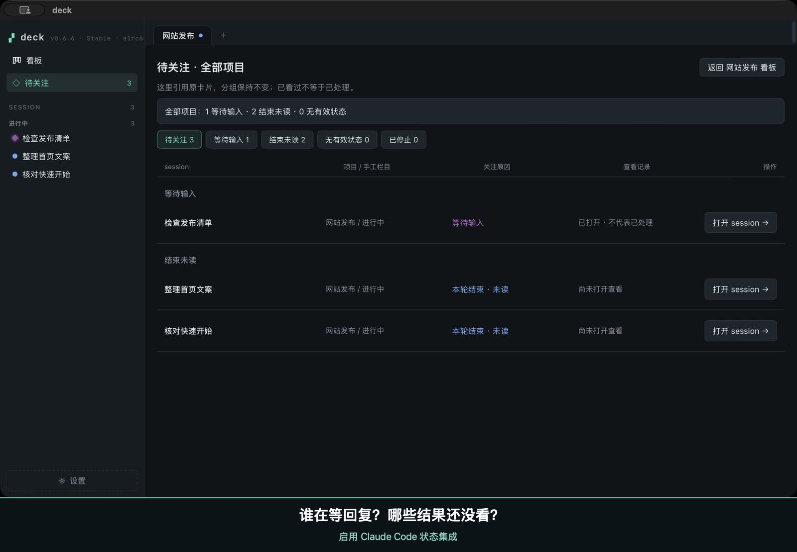

# deck

**You can run many agents. There is still only one of you.**

deck is a native macOS app for the terminal work you leave running: Claude
Code, Codex, shells and scripts. Each runs in a real local session on a board
you arrange, and deck brings back the sessions that report they need you, so
you stop checking every terminal to find out.

[Website](https://deck.c9r.io/) · [Watch the 26-second demo](https://deck.c9r.io/#demo) · [Download Stable](https://github.com/c9r-io/deck/releases/latest) · [User guide](https://deck.c9r.io/guide/) · [简体中文](docs/zh-Hans.md)

*26 seconds recorded in Deck 0.6.6: find a waiting Claude session, open its
terminal, approve a request, and read the result. Chinese interface and
captions, no audio; waiting time is cut.*

## What it does

- **Brings back the work that needs you.** With Claude Code or Codex status
  integration enabled, *Needs attention* gathers reported input requests and
  unread turn endings across every project. Optional macOS notifications and a
  Dock count reach you while deck is in the background. A turn ending is an
  interaction boundary, not proof the task succeeded.
- **Stays out of the way otherwise.** Cards stay where you put them; status
  never moves a card. Without a status report, deck shows only output activity
  and says so: quiet does not mean ready or done.
- **Keeps sessions running without it.** Each card is a real tmux session on
  deck's own private server. Quit or crash deck and your work keeps going;
  reopen it and everything is where you left it.

When coverage is missing, deck says so instead of guessing. Codex on its shared
background service (the default since 0.157) does not report which terminal a
hook came from, so deck rejects those events and shows no agent status for it.

## What deck deliberately doesn't do

Many tools in this space help you run agents in parallel. deck goes the other
way: agents already manage their own work, and they keep getting better at it.
The scarce resource is your attention across all of it, so that is the only
thing deck manages.

- **No worktrees, branches or PR workflow.** Your agent handles those; deck
  never touches your repository.
- **No agent orchestration.** No headless runs, agent pools, task planning or
  permission auto-approval. deck types into a terminal only where you asked it
  to, and only after checking the target.
- **No judging success.** deck reports what an agent said, never whether the
  work is done. You read the result and decide.
- **No automatic board.** Nothing moves a card based on status or a guess
  about what a task means.

As Claude Code, Codex and other CLIs improve, deck has less to work around, and
it works the same with a plain shell.

## Install

Requires **macOS 11 or later on Apple Silicon**. Intel Macs are not currently
supported.

1. Download `deck_<version>_aarch64.dmg` from the
   [latest Stable release](https://github.com/c9r-io/deck/releases/latest).
2. Open the DMG, drag **deck** to **Applications**, then open deck. The app is
   signed and Apple-notarized, and tmux is included.
3. Select a project and click **＋ New session**. `cd` to your working
   directory and run `claude`, `codex` or any ordinary command.
4. To see input requests and turn endings, enable the matching Agent status
   option in **Settings → Agents & notifications**.

deck runs locally: no deck account, cloud service or hosted task server.
Install and sign in to your agent CLI separately; its model service and
charges belong to that tool. Updates appear as a button in the sidebar.

[First-task walkthrough](https://deck.c9r.io/guide/start/) · [Status integration and signals](https://deck.c9r.io/guide/attention/)

## Also included

Split panes, command completion, on-device voice input, prompt lists and
templates, clock and Slack-reaction automations, and optional, disabled-by-
default integrations (Phone Connector, MCP, ChatGPT Secure Tunnel). None is
needed for ordinary use; each has its own boundaries, documented in the guide.

## Documentation

- [User guide](https://deck.c9r.io/guide/): tasks and signals, for the published Stable release
- [Technical reference](docs/reference.md): behaviour, data, privacy and build contracts, following `main`
- [Release channels](docs/release-channels.md): Stable, Nightly and recovery
- [MCP](docs/mcp.md) · [Secure Tunnel](docs/secure-tunnel.md) · [Notifications](docs/notifications.md) · [Voice input](docs/voice-input.md)

## Feedback

Use the [feedback issue form](https://github.com/c9r-io/deck/issues/new?template=feedback.yml)
to tell us what became easier or what got in your way. GitHub issues are public:
do not include prompts, commands, terminal output, secrets, private paths,
session names, project names, or repository names.

## License

MIT
